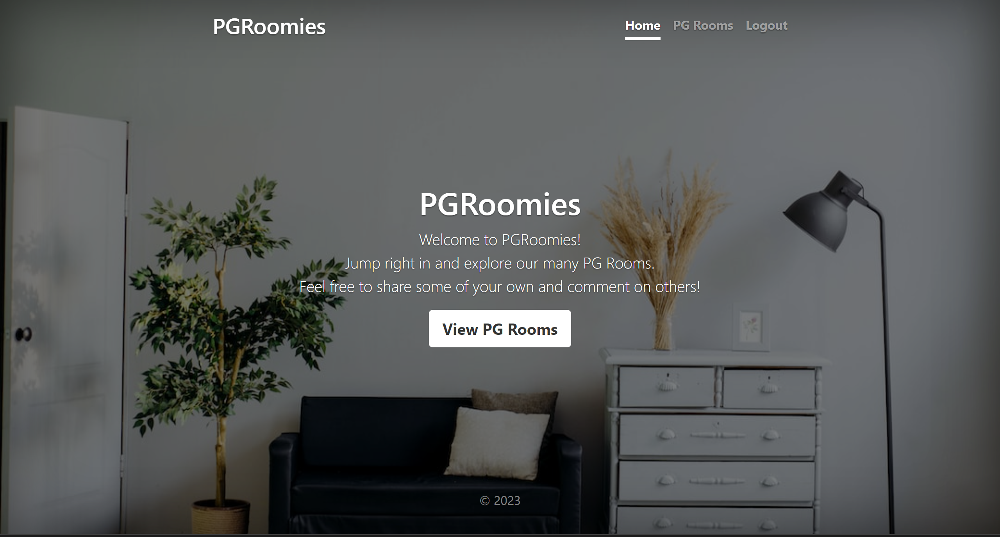

# PG Roomies

 <p align="center">
  

PGRommies is a website where students can create and review PG Rooms. In order to review or create a one, you must have an account.  
This project was created using Node.js, Express, MongoDB, and Bootstrap. Passport.js was used to handle authentication.

## Features

- Users can create, edit, and remove PG Rooms
- Users can review PG Rooms once, and edit or remove their review
- User profiles include more information on the user (full name, email, phone, join date), their PG Rooms, and the option to edit their profile or delete their account
- Search PG Rooms by name or location
- Sort PG Rooms by highest rating, most reviewed, lowest price, or highest price

## Run it locally

1. Install [mongodb](https://www.mongodb.com/)
2. Create a cloudinary account to get an API key and secret code

```
git clone https://github.com/MoharTry/PG_Roomies.git
cd PG_Roomies
npm install
```

## Built With

- [Node.js](https://nodejs.org) - Node.js® is a JavaScript runtime built on Chrome's V8 JavaScript engine.
- [express](https://expressjs.com//) - Fast, unopinionated, minimalist web framework for Node.js
- [MongoDB](https://www.mongodb.com/) - The database for modern applications
- [Mongoose](https://mongoosejs.com/) - Elegant MongoDB object modeling for Node.js
- [ejs](https://ejs.co/) - Embedded JavaScript templating

Create a .env file (or just export manually in the terminal) in the root of the project and add the following:

```
DATABASEURL='<url>'
API_KEY=''<key>
API_SECRET='<secret>'
```

Run `mongod` in another terminal and `node app.js` in the terminal with the project.

Then go to [localhost:3000](http://localhost:3000/).

To get google maps working check [this](https://github.com/nax3t/google-maps-api) out.
